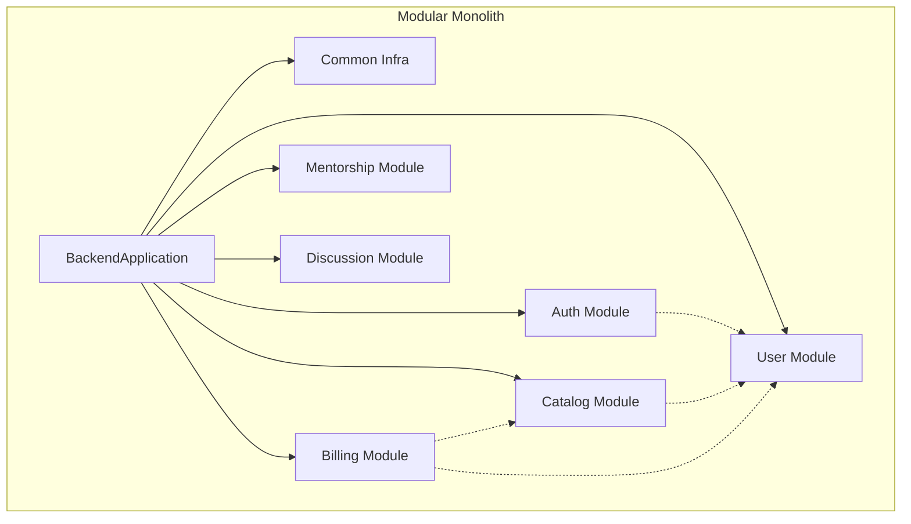
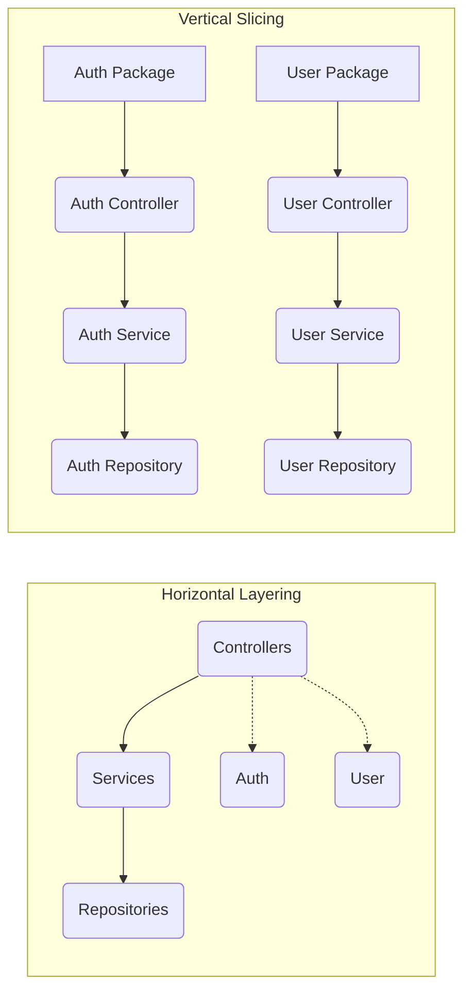
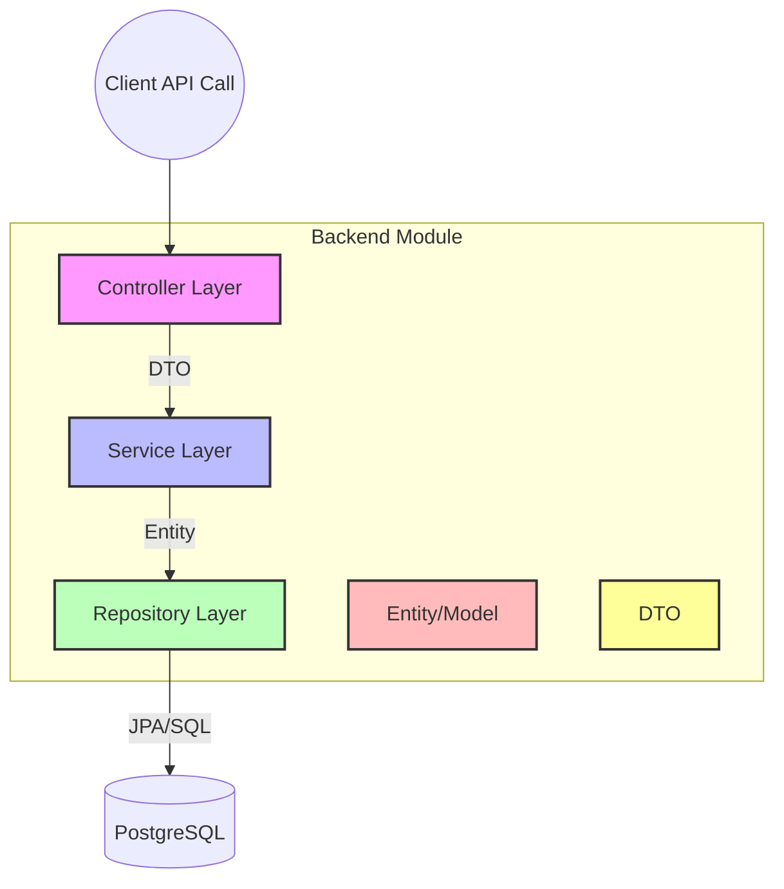
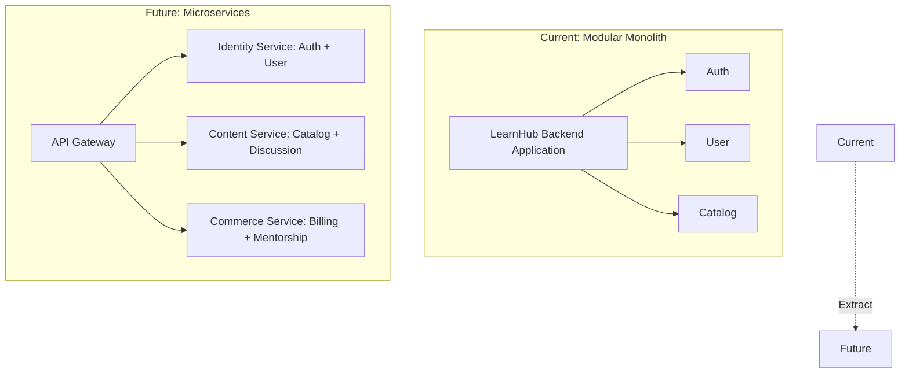
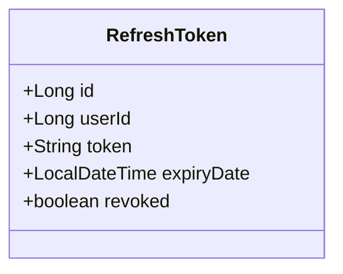
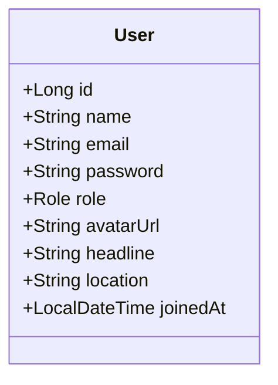

# LearnHub Backend Development Handbook - Part 1: Architecture

Welcome to Part 1 of the LearnHub Backend Development Handbook! This guide is designed to serve as the single source of truth for the entire backend development team, especially for CDAC PG-DAC and PGCP-AC students. It covers the core architectural decisions, folder structure, and module ownership of the LearnHub platform.

---

## Section 1: Project Architecture

### 1.1 What is a Modular Monolith?

LearnHub is built using a **Modular Monolith** architecture. A traditional monolith bundles all code into a single, highly coupled application. A microservices architecture splits the code into completely independent, separately deployable services. A modular monolith sits in between: it is a single application (one Spring Boot `@SpringBootApplication`, one deployment), but the codebase is strictly divided into isolated modules based on business domains.

**Why did we choose this?**
- **Simplicity:** Easier to deploy, test, and debug than distributed microservices.
- **Maintainability:** Clear boundaries prevent "spaghetti code."
- **Future-Proofing:** Easily extractable into microservices later if scaling demands it.

> [!TIP]
> **Interview Prep:** Interviewers often ask about the trade-offs between Monoliths and Microservices. A Modular Monolith is an excellent middle-ground answer, showing you understand both business context (cost/complexity) and technical boundaries (domain-driven design).

### 1.2 Horizontal Layered vs Vertical Domain Architecture

In Spring Boot, there are two primary ways to organize packages: Horizontal Layering (by technical concern) and Vertical Slicing (by business domain). LearnHub uses **Vertical Domain Architecture**.

| Feature | Horizontal Layered (Traditional) | Vertical Domain (LearnHub) |
| :--- | :--- | :--- |
| **Organization** | By technical layer (`controllers`, `services`, `models`) | By business domain (`user`, `catalog`, `auth`) |
| **Coupling** | High across domains (changes span multiple folders) | Low across domains (changes are localized) |
| **Microservice Readiness** | Very hard to extract | Very easy to extract |
| **Navigation** | You scroll past all controllers to find one | All related code is grouped together |

### 1.3 Domain Ownership Principles

1. **Self-Contained:** A module should handle its own business logic, database entities, and REST APIs.
2. **Encapsulated:** Modules expose functionality via controllers or public service interfaces. Internal helpers should be package-private.
3. **Database Isolation (Logical):** Even though we use a single PostgreSQL database, tables logically belong to specific modules. A module should only write to its own tables.

### 1.4 Layer Responsibilities

Within each vertical domain (e.g., `user`), we still follow a layered architecture.

- **Controller (`@RestController`):** Handles HTTP requests, input validation, and returns HTTP responses. *Rule: No business logic here.*
- **Service (`@Service`):** Contains the core business logic. Coordinates repositories and performs calculations.
- **Repository (`@Repository`):** Spring Data JPA interfaces for database operations.
- **Entity (`@Entity`):** Java representations of database tables.
- **DTO (Data Transfer Object):** Objects used to pass data between the client and server, preventing exposure of internal Entities.

### 1.5 Future Microservice Extraction Strategy

When LearnHub grows, we may need to split the application. Because we are already using vertical slices, extraction is straightforward.

### 1.6 Why Roles (Learner, Creator, Admin) are NOT Separate Packages

A common mistake is creating packages like `learner/`, `creator/`, and `admin/`. 

**Why is this wrong?**
- **Code Duplication:** A Learner buys a course, a Creator views sales, an Admin refunds it. All three interact with `Billing`. Splitting by role means duplicating billing logic.
- **Roles are Attributes, Not Domains:** A user's role is just a piece of data (an enum `LEARNER`, `CREATOR`, `ADMIN`).
- **Security Handles Roles:** We use Spring Security (`@PreAuthorize("hasRole('CREATOR')")`) to restrict access at the controller level, not by physical folders.

> [!IMPORTANT]
> Always organize by **"What is the data/domain?"** (User, Catalog, Billing), NEVER by **"Who is using it?"** (Learner, Admin).

### 1.7 Cross-Module Communication Rules

Modules often need data from each other (e.g., a `Purchase` in Billing needs a `User` from User module).
- **Rule 1: Store IDs, not Entity References.** The `purchases` table should store `user_id`, not an entire `User` object or `@ManyToOne` mapping across module boundaries (if we plan strict extraction).
- **Rule 2: Service-to-Service Calls.** If Billing needs user details, `BillingService` injects `UserService` and calls `userService.getUserById(id)`, rather than injecting `UserRepository` directly.

---

## Section 2: Backend Folder Structure

The current codebase is structured under `com.learnhub.backend`.

### 2.1 `common/` - Shared Infrastructure
This package contains code used across multiple modules.
- **`config/`**: Global configurations.
  - *Examples:* `SecurityConfig.java`, `CorsConfig.java`, `WebMvcConfig.java`.
- **`dto/`**: Standardized response structures used by all endpoints.
  - *Examples:* `ApiResponse.java` (wrapper for success/failure), `ErrorResponse.java`.
- **`exception/`**: Global error handling.
  - *Examples:* `GlobalExceptionHandler.java` (using `@ControllerAdvice`), custom exceptions like `ResourceNotFoundException.java`.
- **`util/`**: Reusable utility classes.
  - *Examples:* `JwtUtil.java`, `Constants.java`.

### 2.2 Business Modules (`auth/`, `user/`, `catalog/`, `billing/`, `discussion/`, `mentorship/`)

Every business module follows the exact same internal structure:

| Folder | What goes here | Naming Convention | Annotations Used |
| :--- | :--- | :--- | :--- |
| **`controller/`** | API Endpoints | `[Domain]Controller.java` | `@RestController`, `@RequestMapping` |
| **`service/`** | Business Logic | `[Domain]Service.java` | `@Service`, `@Transactional` |
| **`repository/`** | DB Access | `[Domain]Repository.java` | `@Repository` (interface extending JpaRepository) |
| **`entity/`** | Database Models | `[Domain].java` | `@Entity`, `@Table`, `@Id` |
| **`dto/`** | Request/Response models | `[Action][Domain]Request.java` | `@Data` (Lombok) |

---

## Section 3: Module Ownership

This section details the current state of each module and what needs to be built. Treat the current codebase as the source of truth.

### 3.1 Auth Module (`auth/`)
Handles authentication, token generation, and token validation.

- **Responsibilities:** Login, Registration (delegating to User module), JWT issuance, Refresh token management.
- **Owned Tables:** `refresh_tokens`
- **Current Entities:** `RefreshToken`
- **Current Repositories:** `RefreshTokenRepository`
- **Current Services:** `AuthService`
- **Current Controllers:** `AuthController` (`/api/auth`)
- **To Be Built:** Login endpoint, token refresh endpoint, JWT filter integration.

### 3.2 User Module (`user/`)
Manages user profiles and identity.

- **Responsibilities:** Fetching user details, updating profiles, managing roles.
- **Owned Tables:** `users`
- **Current Entities:** `User`
- **Current Repositories:** `UserRepository`
- **Current Services:** `UserService`
- **Current Controllers:** `UserController` (`/api/users`)
- **To Be Built:** Profile update APIs, avatar upload handling, admin user management.

### 3.3 Catalog Module (`catalog/`)
The core content engine where creators publish courses/resources.

- **Responsibilities:** Managing categories, courses, articles, searching, filtering content.
- **Owned Tables:** `categories`, `contents`, `reviews`
- **Current Entities:** `Category`
- **Current Repositories:** Stubbed
- **Current Services:** Stubbed
- **Current Controllers:** `CatalogController` (`/api/catalog` - status only)
- **To Be Built:** `Content` entity, `Review` entity, CRUD APIs for content (Creators), browsing/searching APIs (Learners).

### 3.4 Billing Module (`billing/`)
Handles purchases and payments.

- **Responsibilities:** Checkout process, payment gateway integration mock, transaction history.
- **Owned Tables:** `purchases`
- **Current Entities:** None (Stubbed)
- **Current Repositories:** Stubbed
- **Current Services:** Stubbed
- **Current Controllers:** `BillingController` (`/api/billing` - status only)
- **To Be Built:** `Purchase` entity, mock payment processing, purchase history API.

### 3.5 Discussion Module (`discussion/`)
Q&A forum for courses.

- **Responsibilities:** Posting questions on content, replying to questions.
- **Owned Tables:** `questions`, `discussion_replies`
- **Current Entities:** None (Stubbed)
- **Current Repositories:** Stubbed
- **Current Services:** Stubbed
- **Current Controllers:** `DiscussionController` (`/api/discussion` - status only)
- **To Be Built:** `Question` and `DiscussionReply` entities, APIs to fetch threads per content, APIs to post/reply.

### 3.6 Mentorship Module (`mentorship/`)
1-on-1 doubt sessions.

- **Responsibilities:** Scheduling sessions, generating Jitsi meeting links.
- **Owned Tables:** `doubt_sessions`
- **Current Entities:** None (Stubbed)
- **Current Repositories:** Stubbed
- **Current Services:** Stubbed
- **Current Controllers:** `MentorshipController` (`/api/mentorship` - status only)
- **To Be Built:** `DoubtSession` entity, booking APIs, creator availability logic.

> [!CAUTION]
> **Database Init Note:** We are using `ddl-auto=update` and `data.sql` for seeding. Ensure your Entity mappings exactly match the tables defined in `schema.sql` to avoid startup errors.
