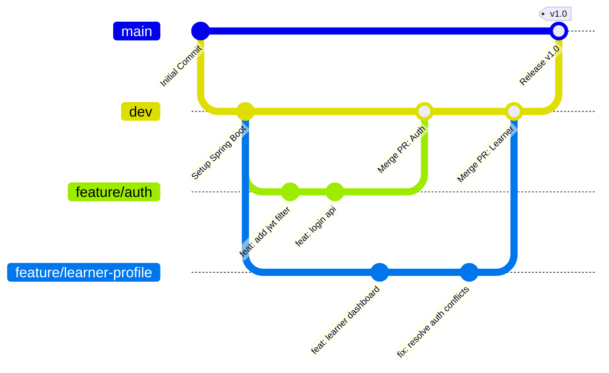

# LearnHub Backend Development Handbook - Part 2

Welcome to Part 2 of the LearnHub Backend Development Handbook! This document serves as the **Single Source of Truth** for our team's development plan, Git workflow, and feature ownership. 

> [!IMPORTANT]
> **CDAC PG-DAC/PGCP-AC Students**: This document outlines professional industry practices. Following these guidelines will not only ensure our project's success but also prepare you for real-world software engineering roles and interviews.

---

## 4. Team Development Plan

To prevent merge conflicts and ensure smooth collaboration, we have divided the LearnHub backend features among the team. **Stick to your assigned packages and files.** If you need to modify a file owned by someone else, you **must** communicate with them first.

> [!WARNING]
> **Shared Packages Warning**: Multiple team members will be working inside the `user/`, `catalog/`, and `billing/` packages. To avoid Git conflicts:
> - Do not modify imports or class signatures of files you don't own.
> - Communicate when modifying shared Entities (like `User.java` or `Resource.java`).
> - Pull from the `dev` branch daily before starting your work.

### 4.1 Yashwant's Development Plan

**Responsibilities Summary**:
Yashwant is responsible for the core Authentication system and the entire Creator experience, including the dashboard, content studio (uploading/publishing), management grid (CRUD for resources), and the creator profile.

**Modules to Touch**:
- `auth/` (Complete ownership)
- `catalog/` (Creator's resource management)
- `user/` (Creator profile management)

**Files to Create/Modify**:
- `src/main/java/com/learnhub/auth/controller/AuthController.java`
- `src/main/java/com/learnhub/auth/service/AuthService.java`
- `src/main/java/com/learnhub/auth/service/JwtService.java`
- `src/main/java/com/learnhub/auth/repository/TokenRepository.java`
- `src/main/java/com/learnhub/catalog/controller/CreatorContentController.java`
- `src/main/java/com/learnhub/catalog/service/CreatorContentService.java`
- `src/main/java/com/learnhub/user/controller/CreatorProfileController.java`

**Files NOT to Modify**:
- `LearnerProfileController.java` (Owned by Riya)
- `PublicCatalogController.java` (Owned by Shubham/Sakshi)
- `PaymentController.java` (Owned by Sakshi)

**Expected Git Branches**:
- `feature/auth-login-register`
- `feature/creator-dashboard`
- `feature/content-studio`

**Expected Commits**:
- `feat(auth): implement JWT generation and validation`
- `feat(catalog): add endpoint for creators to upload PDF resources`

**Expected PRs**:
- *Title*: `Feature: Authentication and JWT Setup` (Source: `feature/auth-login-register` → Target: `dev`)

**Dependencies & Integration**:
- *Must finish first*: Auth module (Everyone depends on User authentication and JWT tokens to test their secure endpoints).
- *Integration Sequence*: Merge Auth first, then Creator Profile, then Content Studio.

---

### 4.2 Riya's Development Plan

**Responsibilities Summary**:
Riya owns the Learner experience. This includes the learner dashboard, purchase history, learner profile, and the personal library where learners access their purchased content.

**Modules to Touch**:
- `user/` (Learner profile and dashboard)
- `billing/` (Purchase history view)
- `mentorship/` (Viewing booked doubt sessions)

**Files to Create/Modify**:
- `src/main/java/com/learnhub/user/controller/LearnerProfileController.java`
- `src/main/java/com/learnhub/user/service/LearnerProfileService.java`
- `src/main/java/com/learnhub/billing/controller/PurchaseHistoryController.java`
- `src/main/java/com/learnhub/billing/service/PurchaseHistoryService.java`
- `src/main/java/com/learnhub/user/controller/LearnerLibraryController.java` (For reading purchased content)

**Files NOT to Modify**:
- `CreatorProfileController.java` (Owned by Yashwant)
- `PaymentCheckoutService.java` (Owned by Sakshi - Riya only reads billing data, Sakshi writes it)

**Expected Git Branches**:
- `feature/learner-profile`
- `feature/learner-library`
- `feature/purchase-history`

**Expected Commits**:
- `feat(user): create learner dashboard statistics endpoint`
- `feat(billing): implement fetch purchase history by user ID`

**Expected PRs**:
- *Title*: `Feature: Learner Dashboard and Library` (Source: `feature/learner-library` → Target: `dev`)

**Dependencies & Integration**:
- *Depends on*: Yashwant's Auth (to get logged-in user ID) and Sakshi's Payment (need dummy purchases to test purchase history).
- *Integration Sequence*: Merge after Auth and basic Payment structures are in place.

---

### 4.3 Sakshi's Development Plan

**Responsibilities Summary**:
Sakshi is handling the public-facing Landing Page, detailed Resource Pages, and the critical Payment Module (Razorpay integration). 

**Modules to Touch**:
- `catalog/` (Public landing page, Resource details)
- `billing/` (Payment integration, Checkout)

**Files to Create/Modify**:
- `src/main/java/com/learnhub/catalog/controller/LandingPageController.java`
- `src/main/java/com/learnhub/catalog/controller/ResourceDetailController.java`
- `src/main/java/com/learnhub/billing/controller/PaymentController.java`
- `src/main/java/com/learnhub/billing/service/RazorpayService.java`
- `src/main/java/com/learnhub/billing/entity/Transaction.java`

**Files NOT to Modify**:
- `CreatorContentController.java` (Owned by Yashwant)
- `PurchaseHistoryController.java` (Owned by Riya)

**Expected Git Branches**:
- `feature/landing-page`
- `feature/resource-details`
- `feature/razorpay-integration`

**Expected Commits**:
- `feat(catalog): fetch top creators and featured content for landing page`
- `feat(billing): integrate Razorpay order creation API`

**Expected PRs**:
- *Title*: `Feature: Razorpay Checkout Flow` (Source: `feature/razorpay-integration` → Target: `dev`)

**Dependencies & Integration**:
- *Depends on*: Yashwant's Content Studio (need resources in DB to display on landing page/checkout).
- *Integration Sequence*: Landing page can be merged early. Payment module should be tested thoroughly before merging to `dev`.

---

### 4.4 Shubham's Development Plan

**Responsibilities Summary**:
Shubham is responsible for the Marketplace (search/filter), Public Creator Profiles, Admin Management (Superuser features), and the Mentorship Session module (Jitsi integration).

**Modules to Touch**:
- `catalog/` (Marketplace search and filtering)
- `user/` (Public creator profile, Admin user management)
- `mentorship/` (Session CRUD, Jitsi integration)
- `common/` (Admin controllers if centralized)

**Files to Create/Modify**:
- `src/main/java/com/learnhub/catalog/controller/MarketplaceController.java`
- `src/main/java/com/learnhub/user/controller/PublicCreatorProfileController.java`
- `src/main/java/com/learnhub/user/controller/AdminUserController.java`
- `src/main/java/com/learnhub/mentorship/controller/SessionController.java`
- `src/main/java/com/learnhub/mentorship/service/JitsiService.java`

**Files NOT to Modify**:
- `CreatorProfileController.java` (Owned by Yashwant - Shubham handles the *public* view, Yashwant handles the *private/edit* view)
- `LearnerProfileController.java` (Owned by Riya)

**Expected Git Branches**:
- `feature/marketplace-search`
- `feature/admin-dashboard`
- `feature/mentorship-sessions`

**Expected Commits**:
- `feat(catalog): implement pagination and category filters for marketplace`
- `feat(mentorship): generate Jitsi meet links for booked sessions`

**Expected PRs**:
- *Title*: `Feature: Mentorship Session Booking and Jitsi` (Source: `feature/mentorship-sessions` → Target: `dev`)

**Dependencies & Integration**:
- *Depends on*: Yashwant's Auth (for Admin Roles), Sakshi's Payment (for booking paid sessions).
- *Integration Sequence*: Marketplace first, Mentorship Sessions next, Admin features last.

---

## 5. Detailed Git Workflow

Our project uses a standardized Git feature-branch workflow. **We never commit directly to `main` or `dev`.** 
- `main`: Production-ready code only.
- `dev`: Integration branch where all features are tested together.
- `feature/*`: Your personal branches for development.

### Branching Strategy Diagram



### Step-by-Step Developer Workflow

#### 1. Clone & Setup (First Time Only)
```bash
git clone https://github.com/team-group-no-7/project-backend-Java.git
cd project-backend-Java
git checkout dev
```

#### 2. Start a New Feature
Always branch off from `dev`. Ensure your `dev` branch is up to date first.
```bash
git checkout dev
git pull origin dev
git checkout -b feature/your-feature-name
# Example: git checkout -b feature/auth-login
```

#### 3. Daily Pull Strategy (Crucial)
Every morning, or before you start coding, pull the latest changes from `dev` into your feature branch to avoid massive conflicts later.
```bash
git checkout feature/your-feature-name
git fetch origin
git merge origin/dev
# Resolve any conflicts if they occur
```

#### 4. Commit Strategy (Conventional Commits)
Make small, logical commits. Use the standard prefixes:
- `feat:` (New feature)
- `fix:` (Bug fix)
- `docs:` (Documentation updates)
- `refactor:` (Code changes that neither fix a bug nor add a feature)

```bash
git add .
git commit -m "feat(auth): implement JWT token generation"
```

#### 5. Push to GitHub
```bash
git push origin feature/your-feature-name
```

#### 6. Create a Pull Request (PR)
1. Go to GitHub.
2. Click "Compare & pull request".
3. **Base branch**: `dev` | **Compare branch**: `feature/your-feature-name`
4. Add a descriptive title and link any Jira/Trello tasks.
5. Request a review from at least one team member.

#### 7. Code Review & Merge
- The reviewer checks the code (looks for hardcoded values, missing comments, security flaws).
- If approved, the reviewer or the author clicks "Squash and Merge" to merge the branch into `dev`.
- **Delete the feature branch** on GitHub after merging.

#### 8. Production Release (Team Lead Action)
Once `dev` is stable and tested:
```bash
git checkout main
git pull origin main
git merge origin/dev
git tag -a v1.0.0 -m "Release version 1.0.0"
git push origin main --tags
```

> [!TIP]
> **Conflict Resolution**: If you get a merge conflict, don't panic! Open your IDE (IntelliJ/VS Code). The IDE will show you `<<<<<<< HEAD` (your changes) and `>>>>>>> dev` (incoming changes). Choose which code to keep, save the file, `git add .`, and `git commit`.

---

## 15A. Feature Ownership Matrix

This matrix clearly defines who is responsible for what. Use this to know who to ask when you need an API or need to modify a shared file.

| Feature Name | Owner | Backend Package | Primary Controller | Primary Entity | Core REST Endpoints | Frontend Consumer | Dependencies | Git Branch |
|---|---|---|---|---|---|---|---|---|
| **Auth & Security** | Yashwant | `auth/` | `AuthController` | `User`, `Token` | `POST /api/auth/login`<br>`POST /api/auth/register` | Login/Register Pages | None (Foundation) | `feature/auth` |
| **Creator Content Studio** | Yashwant | `catalog/` | `CreatorContentController` | `Resource` | `POST /api/creator/content`<br>`PUT /api/creator/content/{id}` | Content Upload Dashboard | Auth | `feature/content-studio` |
| **Creator Profile & Dashboard** | Yashwant | `user/` | `CreatorProfileController` | `User` | `GET /api/creator/profile`<br>`GET /api/creator/stats` | Creator Dashboard | Auth | `feature/creator-dashboard`|
| **Learner Profile & Dashboard** | Riya | `user/` | `LearnerProfileController` | `User` | `GET /api/learner/profile`<br>`GET /api/learner/stats` | Learner Dashboard | Auth | `feature/learner-profile` |
| **Learner Library** | Riya | `user/`, `billing/`| `LearnerLibraryController` | `Purchase` | `GET /api/learner/library` | My Library Page | Auth, Payments | `feature/learner-library` |
| **Purchase History** | Riya | `billing/` | `PurchaseHistoryController` | `Transaction` | `GET /api/learner/purchases` | Purchase History Page | Payments | `feature/purchase-history` |
| **Landing Page Data** | Sakshi | `catalog/` | `LandingPageController` | `Resource`, `Category` | `GET /api/public/featured`<br>`GET /api/public/categories` | Home/Landing Page | Content Studio | `feature/landing-page` |
| **Resource Details** | Sakshi | `catalog/` | `ResourceDetailController` | `Resource`, `Review`| `GET /api/public/resource/{id}` | Single Resource Page | Content Studio | `feature/resource-details` |
| **Payment & Checkout** | Sakshi | `billing/` | `PaymentController` | `Transaction` | `POST /api/payment/create-order`<br>`POST /api/payment/verify` | Checkout Page | Auth | `feature/payment-razorpay` |
| **Marketplace Search** | Shubham | `catalog/` | `MarketplaceController` | `Resource` | `GET /api/public/search?q=...` | Browse/Search Page | Content Studio | `feature/marketplace` |
| **Public Creator View** | Shubham | `user/` | `PublicCreatorProfileController`| `User` | `GET /api/public/creator/{id}` | Public Creator Profile | Creator Profile | `feature/public-creator` |
| **Admin Dashboard** | Shubham | `common/`, `user/`| `AdminController` | `User`, `Resource` | `GET /api/admin/users`<br>`PUT /api/admin/resource/approve` | Admin Panel | Auth (Admin Role) | `feature/admin-dashboard` |
| **Mentorship Sessions**| Shubham | `mentorship/`| `SessionController` | `Session` | `POST /api/sessions/book`<br>`GET /api/sessions/{id}/join` | Session Booking Page | Auth, Payments | `feature/mentorship-sessions`|

> [!NOTE]
> **Testing Responsibility**: You are responsible for unit testing (JUnit/Mockito) and Postman testing for every endpoint listed under your name in the matrix above. Do not hand over an API to the frontend team until you have verified it yourself in Postman.
