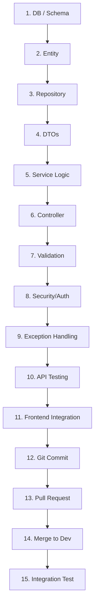

# LearnHub Backend Development Handbook - Part 3

Welcome to Part 3 of the LearnHub Backend Development Handbook. This document is the **Single Source of Truth** for our implementation strategy and API contracts. It is explicitly designed for CDAC PG-DAC / PGCP-AC students to bridge the gap between classroom theory and industry-level backend engineering.

---

## SECTION 6: IMPLEMENTATION ROADMAP

In a professional environment, building a feature is not just about writing a Controller and a Service. It follows a rigorous lifecycle. For every feature assigned to your team, we will follow the **15-Step Feature Development Lifecycle**.



### 6.1 Yashwant: Auth & Creator Studio

**Features:** Authentication (Register/Login/Refresh), Creator Dashboard, Content Studio (CRUD Contents).
**Deep Dive: User Registration Feature (Auth)**

1. **Database Changes:** The `users` table already exists in `schema.sql`. Ensure `email` is marked `UNIQUE` to prevent duplicate registrations.
2. **Entity:** Ensure the `User` entity has `@Table(name = "users")` and mapped fields.
3. **Repository:**
   ```java
   public interface UserRepository extends JpaRepository<User, Long> {
       boolean existsByEmail(String email);
       Optional<User> findByEmail(String email);
   }
   ```
4. **DTO (Request/Response):**
   ```java
   public class RegisterRequestDto {
       @NotBlank(message = "Name cannot be empty")
       private String name;

       @Email(message = "Invalid email format")
       @NotBlank(message = "Email is required")
       private String email;

       @NotBlank(message = "Password is required")
       @Size(min = 6, message = "Password must be at least 6 characters")
       private String password;

       private String role; // LEARNER or CREATOR
   }
   ```
5. **Service (Business Logic):**
   ```java
   @Service
   @RequiredArgsConstructor
   public class AuthService {
       private final UserRepository userRepository;
       private final PasswordEncoder passwordEncoder; // BCrypt

       @Transactional
       public UserResponseDto register(RegisterRequestDto request) {
           // 1. Check if user exists
           if (userRepository.existsByEmail(request.getEmail())) {
               throw new DuplicateResourceException("Email already registered!");
           }
           
           // 2. Map DTO to Entity
           User user = new User();
           user.setName(request.getName());
           user.setEmail(request.getEmail());
           user.setPassword(passwordEncoder.encode(request.getPassword()));
           user.setRole(request.getRole() != null ? request.getRole() : "LEARNER");
           user.setJoinedAt(LocalDateTime.now());
           
           // 3. Save to DB
           User savedUser = userRepository.save(user);
           
           // 4. Return Response DTO (never return Entity directly)
           return mapToResponse(savedUser);
       }
   }
   ```
   > [!TIP]
   > **Interview Corner:** "Why do we use DTOs instead of Entities?" -> Entities represent the database table structure, which often contains sensitive data (like passwords). DTOs allow us to decouple the API contract from the database, hide sensitive info, and prevent Mass Assignment vulnerabilities.

6. **Controller:**
   ```java
   @RestController
   @RequestMapping("/api/auth")
   @RequiredArgsConstructor
   public class AuthController {
       private final AuthService authService;

       @PostMapping("/register")
       public ResponseEntity<UserResponseDto> registerUser(@Valid @RequestBody RegisterRequestDto request) {
           return new ResponseEntity<>(authService.register(request), HttpStatus.CREATED);
       }
   }
   ```
7. **Validation:** Applied `@Valid` in Controller and `@NotBlank` in DTO.
8. **Security:** Update `SecurityConfig.java` to permit all for `/api/auth/**`.
9. **Exception Handling:** Handled via `@RestControllerAdvice` converting `DuplicateResourceException` to 409 Conflict.
10. **API Testing:** Run Postman with a raw JSON POST body.
11. **Frontend Integration:** React will use `axios.post('/api/auth/register', data)`.
12. **Git Commit Message:** `feat(auth): implement user registration with BCrypt hashing`
13. **Pull Request Description:** "Adds user registration endpoint. Validates duplicate emails. Hashes passwords. Fixes #12."
14. **Merge to dev:** Approved by peer and merged.
15. **Integration Test:** Write `@SpringBootTest` to verify DB insertion.

---

### 6.2 Riya: Learner Dashboard & Purchase History

**Features:** Learner dashboard, Purchase history, Learner Profile (My Library).
**Deep Dive: Purchase History Feature**

1. **Database Changes:** Relying on `purchases` table mapped in `schema.sql`.
2. **Entity:** `Purchase` entity with `@ManyToOne` mapping to `User` and `Content`.
3. **Repository:**
   ```java
   public interface PurchaseRepository extends JpaRepository<Purchase, Long> {
       List<Purchase> findByUserIdOrderByPurchasedAtDesc(Long userId);
   }
   ```
4. **DTO:** `PurchaseHistoryDto` containing content title, amount paid, and purchased date.
5. **Service:**
   ```java
   @Service
   public class PurchaseService {
       public List<PurchaseHistoryDto> getMyPurchases(Long userId) {
           List<Purchase> purchases = purchaseRepository.findByUserIdOrderByPurchasedAtDesc(userId);
           // Stream mapping entity to DTO
           return purchases.stream()
               .map(p -> new PurchaseHistoryDto(p.getContent().getTitle(), p.getAmountPaid(), p.getPurchasedAt()))
               .collect(Collectors.toList());
       }
   }
   ```
6. **Controller:**
   ```java
   @GetMapping("/api/users/{userId}/purchases")
   public ResponseEntity<List<PurchaseHistoryDto>> getPurchases(@PathVariable Long userId) {
       return ResponseEntity.ok(purchaseService.getMyPurchases(userId));
   }
   ```
7. **Validation:** Validate `userId` exists.
8. **Security:** Only the logged-in user can access THEIR purchases. Check if `SecurityContextHolder` user ID matches the path variable.
   > [!IMPORTANT]
   > **Common Beginner Mistake:** Missing authorization checks. Without verifying the logged-in user against the `userId` in the path, User A could view User B's purchase history (IDOR vulnerability).
9. **Exception Handling:** `ResourceNotFoundException` if user not found.
10. **Testing:** Postman GET request with Bearer token.
11. **Frontend:** React map over array to display cards in 'My Library'.

---

### 6.3 Sakshi: Payment Module (Razorpay) & Landing Page

**Features:** Landing page endpoints, Resource detail, Razorpay Integration.
**Deep Dive: Create Razorpay Order**

1. **Database Changes:** `purchases` table acts as the order ledger.
2. **Entity:** `Purchase` entity.
3. **Repository:** standard JPA repo.
4. **DTO:** `OrderRequestDto` (contentId), `OrderResponseDto` (orderId, amount, currency).
5. **Service:** Integration with `RazorpayClient`.
   ```java
   @Service
   public class PaymentService {
       @Value("${razorpay.key.id}")
       private String razorpayId;
       @Value("${razorpay.key.secret}")
       private String razorpaySecret;

       @Transactional
       public OrderResponseDto createOrder(OrderRequestDto request, Long userId) {
           // 1. Fetch content price
           Content content = contentRepository.findById(request.getContentId()).orElseThrow();
           
           // 2. Call Razorpay API
           RazorpayClient razorpay = new RazorpayClient(razorpayId, razorpaySecret);
           JSONObject orderRequest = new JSONObject();
           orderRequest.put("amount", content.getPrice() * 100); // paise
           orderRequest.put("currency", "INR");
           
           Order order = razorpay.orders.create(orderRequest);
           
           // 3. Save pending purchase in DB
           Purchase purchase = new Purchase();
           purchase.setUser(new User(userId));
           purchase.setContent(content);
           purchase.setTransactionId(order.get("id"));
           purchase.setPaymentStatus("PENDING");
           purchaseRepository.save(purchase);
           
           return new OrderResponseDto(order.get("id"), content.getPrice());
       }
   }
   ```
   > [!TIP]
   > **Interview Corner:** "What happens if Razorpay API fails?" -> Explain fallback mechanisms, exception handling (RazorpayException), and using `@Transactional` to roll back local database changes if external API fails, though here we call external API *before* local save.

---

### 6.4 Shubham: Marketplace & Admin

**Features:** Marketplace filtering, Session module, Admin analytics.
**Deep Dive: Marketplace Search & Filter**

1. **Database:** `contents` table.
2. **Entity:** `Content` entity.
3. **Repository:** Use JPA Specifications or `@Query` for dynamic filtering.
   ```java
   @Query("SELECT c FROM Content c WHERE " +
          "(:categoryId IS NULL OR c.category.id = :categoryId) AND " +
          "(:search IS NULL OR LOWER(c.title) LIKE LOWER(CONCAT('%', :search, '%')))")
   Page<Content> findMarketplaceContents(@Param("search") String search, 
                                         @Param("categoryId") Long categoryId, 
                                         Pageable pageable);
   ```
4. **Service:** Call the repository with Spring Data `PageRequest`.
5. **Controller:** GET `/api/contents` with `@RequestParam`.
6. **Frontend Integration:** React sends query parameters `?search=react&page=0&size=10`.

---

## SECTION 7: API DOCUMENTATION

This is the exact contract the React frontend developers will use. Do not deviate from these paths or JSON structures without team discussion.

### 7.1 Auth Module

| Method | Endpoint | Purpose | Access |
|---|---|---|---|
| POST | `/api/auth/register` | Register new user | Public |
| POST | `/api/auth/login` | Authenticate & get tokens | Public |
| POST | `/api/auth/refresh` | Get new JWT using refresh token | Public |
| POST | `/api/auth/logout` | Revoke refresh token | Authenticated |

#### **POST /api/auth/login**
*   **Description:** Authenticates a user and returns a JWT.
*   **Request Body:**
    ```json
    {
      "email": "student@cdac.in",
      "password": "password123"
    }
    ```
*   **Response Body (200 OK):**
    ```json
    {
      "accessToken": "eyJhbGciOiJIUzI1NiIsInR5c...",
      "refreshToken": "d8a1c9b2-3e4f-5678-90ab-cdef12345678",
      "user": {
        "id": 1,
        "name": "CDAC Student",
        "email": "student@cdac.in",
        "role": "LEARNER"
      }
    }
    ```
*   **Error Responses:** `401 Unauthorized` (Bad credentials).

### 7.2 Catalog Module

| Method | Endpoint | Purpose | Access |
|---|---|---|---|
| GET | `/api/contents` | Search, filter, and paginate contents | Public |
| GET | `/api/contents/featured` | Get featured content for landing page | Public |
| GET | `/api/contents/{id}` | Get detailed info of a single content | Public |
| POST | `/api/contents` | Create new course/ebook | CREATOR |
| PUT | `/api/contents/{id}` | Update existing content | CREATOR |
| GET | `/api/categories` | Get all categories | Public |

#### **GET /api/contents**
*   **Description:** Paginated catalog for the marketplace.
*   **Query Params:** `search` (string), `categoryId` (long), `page` (int, default=0), `size` (int, default=10).
*   **Response Body (200 OK):**
    ```json
    {
      "content": [
        {
          "id": 101,
          "title": "Mastering Spring Boot",
          "price": 499.00,
          "type": "COURSE",
          "creatorName": "Yashwant Pandey",
          "rating": 4.8
        }
      ],
      "pageNo": 0,
      "pageSize": 10,
      "totalElements": 45,
      "totalPages": 5,
      "last": false
    }
    ```

#### **POST /api/contents**
*   **Description:** Creates new content.
*   **Headers:** `Authorization: Bearer <token>`, `Content-Type: multipart/form-data`
*   **Form Data:** `title`, `description`, `price`, `categoryId`, `file` (MultipartFile PDF/Video), `coverImage` (MultipartFile).

### 7.3 User & Creator Module

| Method | Endpoint | Purpose | Access |
|---|---|---|---|
| GET | `/api/users/{id}` | Get user profile | Authenticated |
| PUT | `/api/users/{id}` | Update profile (headline, location) | Authenticated |
| GET | `/api/creators/{id}` | Public profile of a creator | Public |
| GET | `/api/creators/{id}/contents` | List contents made by creator | Public |

### 7.4 Billing & Payments Module

| Method | Endpoint | Purpose | Access |
|---|---|---|---|
| POST | `/api/payments/create-order` | Init Razorpay transaction | LEARNER |
| POST | `/api/payments/verify` | Verify signature & confirm | LEARNER |
| GET | `/api/users/{id}/purchases` | Get user purchase history | LEARNER |

#### **POST /api/payments/verify**
*   **Description:** Validates Razorpay signature and provisions access to the course.
*   **Request Body:**
    ```json
    {
      "razorpayOrderId": "order_Kxyz1234",
      "razorpayPaymentId": "pay_Kabc5678",
      "razorpaySignature": "b4c2e6..."
    }
    ```
*   **Response Body (200 OK):**
    ```json
    {
      "status": "SUCCESS",
      "message": "Payment verified. Content unlocked!"
    }
    ```

### 7.5 Mentorship & Doubt Sessions Module

| Method | Endpoint | Purpose | Access |
|---|---|---|---|
| POST | `/api/sessions/book` | Schedule 1-on-1 session | LEARNER |
| GET | `/api/users/{id}/sessions` | Get my upcoming sessions | Authenticated |

#### **POST /api/sessions/book**
*   **Description:** Requests a doubt session slot.
*   **Request Body:**
    ```json
    {
      "creatorId": 5,
      "topic": "Spring Security JWT configuration issues",
      "scheduledAt": "2024-05-15T10:00:00"
    }
    ```

### 7.6 Discussion (Q&A) Module

| Method | Endpoint | Purpose | Access |
|---|---|---|---|
| GET | `/api/contents/{id}/questions` | Get Q&A threads for content | Public |
| POST | `/api/contents/{id}/questions` | Ask a new question | Enrolled LEARNER |
| POST | `/api/questions/{id}/replies` | Reply to a question | Authenticated |

### 7.7 Admin Module

| Method | Endpoint | Purpose | Access |
|---|---|---|---|
| GET | `/api/admin/analytics` | Dashboard numbers (revenue, users) | ADMIN |
| GET | `/api/admin/users` | List all users with pagination | ADMIN |
| PATCH | `/api/admin/users/{id}/status`| Block/Unblock user | ADMIN |

> [!WARNING]
> **Security Requirement:** Every endpoint under `/api/admin/**` MUST strictly enforce `@PreAuthorize("hasRole('ADMIN')")`. Failing to do so represents a severe privilege escalation vulnerability.
