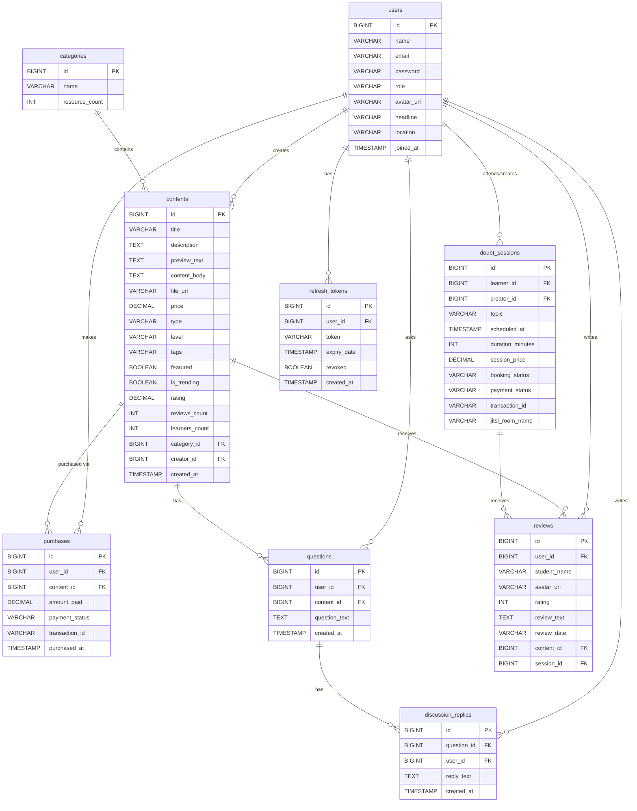
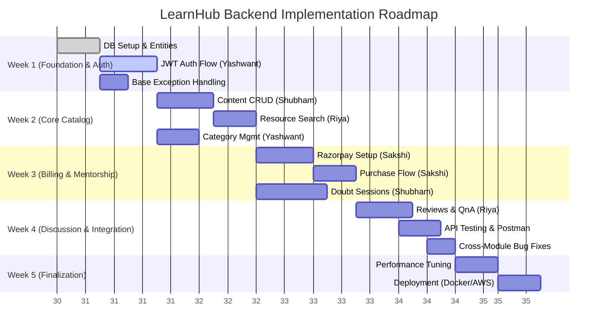

# LearnHub Backend Development Handbook - Part 4
**Project:** LearnHub | **Stack:** Spring Boot 4.1.0, Java 17, PostgreSQL 15 | **Architecture:** Modular Monolith

---

## Section 8: Database Documentation

### 8.1 ER Diagram



### 8.2 Tables and Constraints

| Table | Ownership Module | Primary Key | Important Constraints | Foreign Key Strategy |
| :--- | :--- | :--- | :--- | :--- |
| `users` | `user` | `id` (BIGSERIAL) | `email` (UNIQUE, NOT NULL) | N/A |
| `categories` | `catalog` | `id` (BIGSERIAL) | `name` (UNIQUE, NOT NULL) | N/A |
| `contents` | `catalog` | `id` (BIGSERIAL) | `title` (NOT NULL) | FK→`users` (SET NULL), FK→`categories` (SET NULL) |
| `purchases` | `billing` | `id` (BIGSERIAL) | `transaction_id` (UNIQUE) | FK→`users` (CASCADE), FK→`contents` (CASCADE) |
| `questions` | `discussion` | `id` (BIGSERIAL) | `question_text` (NOT NULL) | FK→`users` (CASCADE), FK→`contents` (CASCADE) |
| `discussion_replies` | `discussion` | `id` (BIGSERIAL) | `reply_text` (NOT NULL) | FK→`questions` (CASCADE), FK→`users` (CASCADE) |
| `doubt_sessions` | `mentorship` | `id` (BIGSERIAL) | `transaction_id` (UNIQUE), `jitsi_room_name` (UNIQUE) | FK→`users` (CASCADE) |
| `reviews` | `discussion` | `id` (BIGSERIAL) | `rating` (CHECK 1-5) | FK→`users` (SET NULL), FK→`contents` (CASCADE), FK→`doubt_sessions` (CASCADE) |
| `refresh_tokens` | `auth` | `id` (BIGSERIAL) | `token` (UNIQUE, NOT NULL) | FK→`users` (CASCADE) |

> [!NOTE]
> **Foreign Key Strategy Explanation**
> - **CASCADE:** We use `CASCADE` for purchases, questions, and tokens linked to users. If a user is deleted, their sensitive data and transactions are purged to maintain data privacy (or if a content is removed, related purchases/questions are purged).
> - **SET NULL:** For `creator_id` in `contents` or `user_id` in `reviews`, if a creator leaves the platform, their courses and reviews should remain available for existing learners, so we just un-link the user ID.

### 8.3 Cross-Module References
In a Modular Monolith, modules should be decoupled. Instead of a `@ManyToOne User user` entity reference in the `catalog` module (which tightly couples `catalog` to `user` module), we simply store `Long creatorId`. This allows modules to be split into microservices later without breaking JPA mappings.

### 8.4 Index Recommendations
To optimize read queries, the following indexes are recommended:
- `CREATE INDEX idx_users_email ON users(email);` (For quick login lookups)
- `CREATE INDEX idx_contents_category ON contents(category_id);` (For filtering courses by category)
- `CREATE INDEX idx_contents_creator ON contents(creator_id);` (For creator dashboards)
- `CREATE INDEX idx_purchases_user ON purchases(user_id);` (For learner dashboard course list)
- `CREATE INDEX idx_refresh_tokens_token ON refresh_tokens(token);` (For token validation)

---

## Section 9: Study Roadmap

### Yashwant (Auth & Creator Features)
| Topic | Est. Time | Priority | Difficulty | Interview Questions |
| :--- | :--- | :--- | :--- | :--- |
| Spring Security Architecture | 6h | HIGH | Hard | What is SecurityFilterChain? How does authentication flow work in Spring? What is UserDetailsService? |
| JWT (JSON Web Tokens) | 4h | HIGH | Medium | Structure of JWT? Why is JWT stateless? How to handle token expiration/refresh tokens? |
| Multipart File Upload | 3h | MEDIUM | Medium | How to handle file uploads in Spring Boot? Difference between storing files in DB vs File System/S3? |
| Custom Exceptions | 2h | LOW | Easy | What is @RestControllerAdvice? How do you create custom error responses? |

### Riya (Learner Features)
| Topic | Est. Time | Priority | Difficulty | Interview Questions |
| :--- | :--- | :--- | :--- | :--- |
| Spring Data JPA derived queries | 4h | HIGH | Easy | How to write a query to find all purchases by user ID? Difference between JpaRepository and CrudRepository? |
| DTO Pattern & MapStruct | 3h | HIGH | Medium | Why use DTOs? How does MapStruct work internally? |
| Pagination & Sorting | 2h | MEDIUM | Medium | How to implement pagination in Spring Data JPA? What is Pageable? |
| REST API Design Principles | 2h | MEDIUM | Easy | Difference between PUT and PATCH? What are idempotency rules in REST? |

### Sakshi (Landing Page & Billing)
| Topic | Est. Time | Priority | Difficulty | Interview Questions |
| :--- | :--- | :--- | :--- | :--- |
| @Transactional Annotation | 4h | HIGH | Hard | What is transaction propagation? What happens if an exception is thrown inside @Transactional? |
| External API Integration (Razorpay) | 5h | HIGH | Hard | How to handle webhook callbacks securely? How do you test external APIs locally? |
| Spring Web MVC Controllers | 3h | MEDIUM | Easy | Difference between @Controller and @RestController? What does @RequestBody do? |
| Bean Validation (Hibernate Validator) | 2h | LOW | Easy | How to validate nested objects? What is @Valid vs @Validated? |

### Shubham (Marketplace, Admin & Sessions)
| Topic | Est. Time | Priority | Difficulty | Interview Questions |
| :--- | :--- | :--- | :--- | :--- |
| Complex JPA Queries (@Query) | 5h | HIGH | Hard | How to write Native Queries vs JPQL? When to use which? How to handle N+1 problem? |
| Role-Based Access Control (RBAC) | 4h | HIGH | Medium | How to implement @PreAuthorize? Difference between Role and Authority in Spring Security? |
| Date & Time Handling in Java 8 | 2h | MEDIUM | Easy | Why use LocalDateTime instead of Date? How to store dates in PostgreSQL via JPA? |
| Cross-Module Communication | 3h | MEDIUM | Medium | How do modules communicate without tight coupling? (Events vs Interfaces) |

---

## Section 10: Developer Learning Mode

### 1. Constructor Injection via `@RequiredArgsConstructor`
**Why:** To inject dependencies safely and ensure immutability.
**Why Chosen:** Better than `@Autowired` field injection because it allows testing without Spring context, prevents circular dependencies, and keeps fields `final`.
**Alternative:** Field injection (`@Autowired`) or setter injection.
**Mistakes:** Forgetting to declare fields as `private final`.
**Interview Point:** "Field injection uses reflection and hides dependencies. Constructor injection makes dependencies explicit and enforces them at compile time."

### 2. DTO Pattern
**Why:** Separates internal database models from external API contracts.
**Why Chosen:** Prevents over-posting attacks (mass assignment), hides sensitive data (like passwords), and stabilizes APIs even if DB changes.
**Alternative:** Returning Entities directly.
**Mistakes:** Using entities in `@RequestBody` or returning them in `@GetMapping`.
**Interview Point:** "Returning entities tightly couples the API contract to the database schema and risks exposing sensitive fields like passwords or internal IDs."

### 3. `@Transactional` Annotation
**Why:** Ensures atomic operations (all succeed or all fail).
**Why Chosen:** Critical for operations like Purchases where money is deducted, and a record must be created.
**Alternative:** Manual transaction management using `TransactionTemplate`.
**Mistakes:** Calling a `@Transactional` method from within the same class (proxy bypass), or expecting it to rollback on checked exceptions (it only rolls back on RuntimeExceptions by default).
**Interview Point:** "Spring uses AOP proxies for `@Transactional`. Internal method calls bypass the proxy, meaning no transaction is started."

### 4. Optional<T> for Null-Safe Queries
**Why:** To represent the absence of a value cleanly.
**Why Chosen:** Prevents `NullPointerException`. Standardized by `JpaRepository.findById()`.
**Alternative:** Returning `null` and doing null checks.
**Mistakes:** Calling `Optional.get()` without `Optional.isPresent()`, or returning `Optional` in DTO fields.
**Interview Point:** "Optional forces the developer to handle the missing case explicitly, reducing unexpected NPEs in production."

---

## Section 11: Implementation Checklists

### 11.1 Developer Checklist (Before Commit)
- [ ] Code compiles successfully locally.
- [ ] No `System.out.println()` left (using SLF4j `log.info`/`log.error` instead).
- [ ] All new DTOs use Bean Validation (`@NotNull`, `@NotBlank`, etc.).
- [ ] Endpoints returning data use `ResponseEntity<?>`.
- [ ] No entities are exposed directly in Controller responses.
- [ ] All application logic is in the Service layer, not Controllers.

### 11.2 Reviewer Checklist (During PR Review)
- [ ] Proper HTTP Methods used (GET for read, POST for create, PUT/PATCH for update).
- [ ] Meaningful and consistent naming for methods and variables.
- [ ] Database queries are optimized (no obvious N+1 problems in loops).
- [ ] Exception handling is robust; appropriate custom exceptions are thrown.
- [ ] Commits are logical and messages are descriptive.

---

## Section 12: Common Mistakes

### Spring Boot Mistakes
1. **Fat Controllers:** Putting business logic in controllers instead of services. (Fix: Move logic to `@Service`).
2. **Ignoring Component Scanning:** Placing classes outside the main application package, causing them to not be picked up by Spring.
3. **Hardcoding Config:** Putting secrets or DB URLs directly in code. (Fix: Use `application.yml` and ENV vars).

### Git Mistakes
1. **Committing `application.properties` with real DB passwords.** (Fix: Add to `.gitignore` and use templates).
2. **Working on `main` directly.** (Fix: Always create feature branches).
3. **Force pushing (`git push -f`) to shared branches.** (Fix: Never force push to `main` or `develop`).

### JPA Mistakes
1. **N+1 Query Problem:** Fetching a list of entities and then looping through them to fetch related entities. (Fix: Use `JOIN FETCH` in queries).
2. **Using `@Data` on Entities:** Lombok's `@Data` includes `equals()` and `hashCode()` which can cause infinite loops with bidirectional relationships. (Fix: Use `@Getter` and `@Setter`).

---

## Section 13: Code Standards

### Naming Conventions
- **Classes:** PascalCase (e.g., `UserService`, `CreateCourseRequest`).
- **Methods/Variables:** camelCase (e.g., `getUserById`, `totalPrice`).
- **Packages:** lowercase, dot-separated (e.g., `com.learnhub.billing`).
- **Constants:** UPPER_SNAKE_CASE (e.g., `MAX_LOGIN_ATTEMPTS`).

### Controller Standards
- Base URL: `/api/v1/[resources]`
- Use plural nouns: `/api/v1/users`, `/api/v1/courses`.
- Sub-resources: `/api/v1/courses/{courseId}/reviews`.

### Exception Handling
- Throw custom exceptions in services: `throw new ResourceNotFoundException("User not found");`
- Catch and translate exceptions in `@RestControllerAdvice`.
- Standardized Error Response: `timestamp`, `status`, `error`, `message`, `path`.

---

## Section 14: Integration Guide

### Avoiding Conflicts
- **Branch Naming:** `feature/[module]-[short-desc]` (e.g., `feature/auth-jwt-login`).
- **Pull Requests:** Require at least 1 approval before merging.
- **Constant Communication:** Sync up daily to ensure no one is modifying the same core files simultaneously.

### CORS Configuration
React runs on `localhost:5173` and Spring Boot on `localhost:8080`. Configure CORS globally:
```java
@Configuration
public class WebConfig implements WebMvcConfigurer {
    @Override
    public void addCorsMappings(CorsRegistry registry) {
        registry.addMapping("/api/**")
                .allowedOrigins("http://localhost:5173")
                .allowedMethods("GET", "POST", "PUT", "PATCH", "DELETE")
                .allowedHeaders("*")
                .allowCredentials(true);
    }
}
```

---

## Section 15: Interview Preparation

### Feature 1: Modular Monolith Architecture
**Why:** Faster time to market than microservices, easier local setup, but enforces clean boundaries so it can be split later.
**Questions & Answers:**
1. **Q:** Why not microservices from day 1?
   **A:** Microservices add immense operational overhead (distributed transactions, deployment complexity, latency). A modular monolith gives us the structural benefits of microservices without the DevOps nightmare.
2. **Q:** How do you prevent modules from becoming tightly coupled?
   **A:** By using package-private visibility where possible, relying on IDs instead of Entity references across modules, and using interfaces or events for cross-module communication.

### Feature 2: JWT Authentication Flow
**Why:** Stateless authentication allows the API to easily scale horizontally.
**Questions & Answers:**
1. **Q:** Where do you store the JWT on the client side?
   **A:** Ideally in an HttpOnly, Secure cookie to prevent XSS attacks. If stored in LocalStorage, it's vulnerable to XSS.
2. **Q:** How do you invalidate a JWT before it expires?
   **A:** JWTs are stateless, so you can't easily invalidate them. We use a short-lived Access Token and a long-lived Refresh Token stored in the DB (which *can* be revoked).

---

## Section 16: Final Backend Completion Roadmap



### Weekly Execution Strategy
- **Week 1:** Yashwant implements the full JWT security filter chain. Everyone else focuses on setting up their base modules, defining DTOs, and creating basic Controllers returning mock data.
- **Week 2:** The Catalog is built. Shubham and Riya ensure content can be created, updated, and fetched. Yashwant supports by providing user context from the security context.
- **Week 3:** Sakshi integrates Razorpay and handles webhooks. Shubham builds the scheduling and Jitsi integration for doubt sessions.
- **Week 4:** Discussion forums and reviews are implemented by Riya. Entire team shifts focus to Postman testing and fixing integration bugs (e.g., when a user buys a course, does it show up in their library?).
- **Week 5:** Code freeze. Team works on Dockerization, fixing N+1 query issues, and deploying the backend to a cloud provider like Render or AWS EC2.
